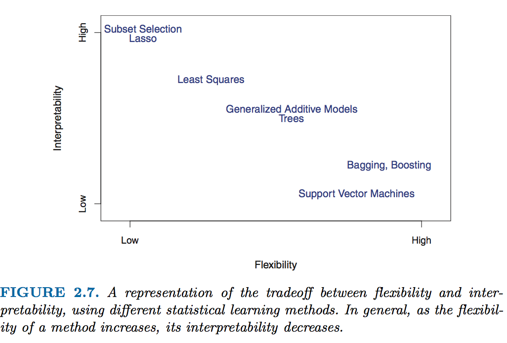

# teller

 [](https://github.com/thierrymoudiki/teller/blob/master/LICENSE) [](https://pepy.tech/project/the-teller) [](https://github.com/Techtonique/teller)


Welcome to the __teller__'s website.

There is an increasing need for __transparency__ and __fairness__ in Machine Learning (ML) models  predictions. Consider for example a banker who has to explain to a client why his/her loan application is rejected, or a health professional who must explain what constitutes his/her diagnosis. Some ML models are indeed very accurate, but are considered to be hard to explain, relatively to popular linear models. 


__Source of figure__: James, Gareth, et al. An introduction to statistical learning. Vol. 112. New York: springer, 2013.


We do not want to sacrifice this high accuracy to explainability.  Hence: __ML explainability__. There are a lot of ML explainability tools out there, _in the wild_ (don't take my word for it).

The `teller` is a __model-agnostic tool for ML explainability__ - agnostic, as long as  this model possesses methods `fit` and `predict`. The `teller`'s philosophy is to rely on [Taylor series](https://en.wikipedia.org/wiki/Taylor_series) to explain ML models predictions: a little increase in model's explanatory variables + a little decrease, and we can obtain approximate sensitivities of its predictions to changes in these explanatory variables. 


The __teller__'s source code is [available on GitHub](https://github.com/Techtonique/teller), and you can read posts about it [in this blog](https://thierrymoudiki.github.io/blog/#ExplainableML).

Looking for a specific function? You can also use the __search__ function available in the navigation bar.

## Installing

- From Pypi, stable version:

```bash
pip install the-teller
```

- From Github, for the development version: 

```bash
pip install git+https://github.com/thierrymoudiki/teller.git
```

## Quickstart 

- [Heterogeneity of marginal effects](https://github.com/Techtonique/teller/blob/master/teller/demo/thierrymoudiki_011119_boston_housing.ipynb)

- [Significance of marginal effects](https://github.com/Techtonique/teller/blob/master/teller/demo/thierrymoudiki_081119_boston_housing.ipynb)

- [Model comparison](https://github.com/Techtonique/teller/blob/master/teller/demo/thierrymoudiki_151119_boston_housing.ipynb)

- [Classification](https://github.com/Techtonique/teller/blob/master/teller/demo/thierrymoudiki_041219_breast_cancer_classif.ipynb)

- [Interactions](https://github.com/Techtonique/teller/blob/master/teller/demo/thierrymoudiki_041219_boston_housing_interactions.ipynb)

## Documentation

- For the [Explainer](documentation/explainer.md)

- For the [Comparator](documentation/comparator.md)


## Contributing

Want to contribute to __teller__'s development on Github, [read this](CONTRIBUTING.md)!